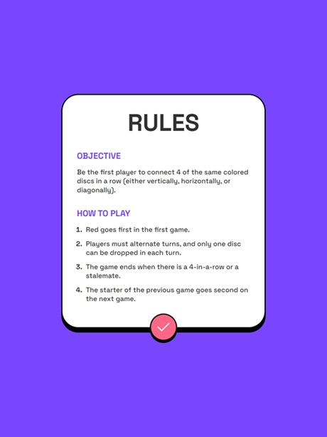
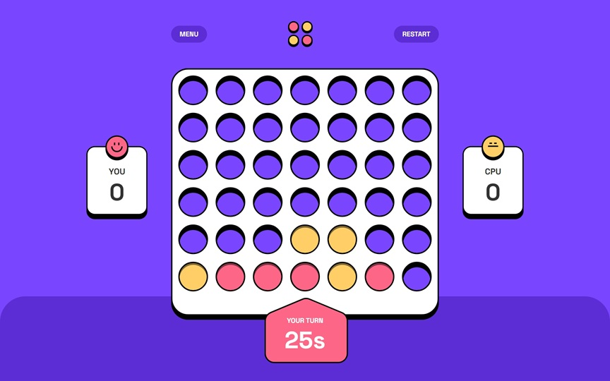
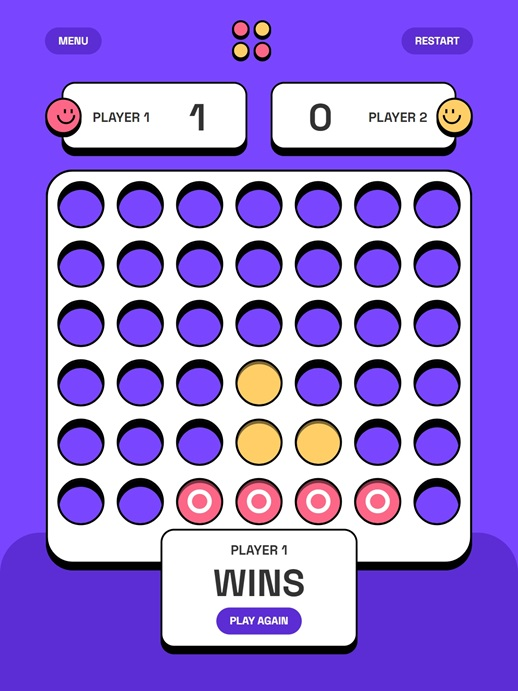

---
runme:
  id: 01HQ5Y6XF0H0FMW88H6WYWXP8F
  version: v3
---

# Frontend Mentor - Connect Four game solution

This is a solution to the [Connect Four game challenge on Frontend Mentor](https://www.frontendmentor.io/challenges/connect-four-game-6G8QVH923s). 

## Table of contents

- [Overview](#overview)
  - [The challenge](#the-challenge)
  - [Screenshot](#screenshot)
  - [Links](#links)
- [My process](#my-process)
  - [Built with](#built-with)
  - [What I learned](#what-i-learned)
  - [Continued development](#continued-development)
- [Author](#author)

## Overview

### The challenge

Users should be able to:

- View the game rules
- Play a game of Connect Four against another human player (alternating turns on the same computer)
- View the optimal layout for the interface depending on their device's screen size
- See hover and focus states for all interactive elements on the page
- **Bonus**: See the discs animate into their position when a move is made
- **Bonus**: Play against the computer

### Screenshot

### Links

- Solution URL: [https://github.com/AnshumanMahato/connect4](https://github.com/AnshumanMahato/connect4)
- Live Site URL: [https://anshumanmahato.github.io/connect4/](https://anshumanmahato.github.io/connect4/)

## My process

### Built with

- [React](https://reactjs.org/) - JS library
- [Redux Toolkit](https://redux-toolkit.js.org/) - JS State Management Library
- [Framer Motion](https://www.framer.com/motion/) - Motion library for React.

### What I learned

- I practiced state management using Redux Toolkit.
- I got an understanding of how traditional game AIs work and implemented an AI for the Player Vs Computer mode.

### Continued development

I am planning to build a backed server to allow players to play from different devices. 

## Author

- Frontend Mentor - [@AnshumanMahato](https://www.frontendmentor.io/profile/AnshumanMahato)
- Telegram - [@AnshumanMahato](https://t.me/AnshumanMahato)
